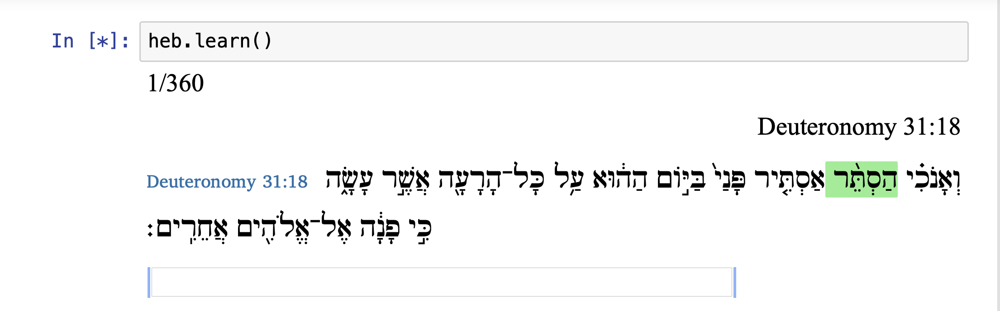
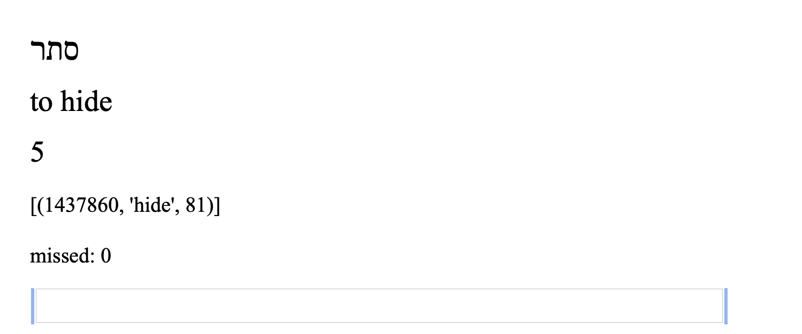

>   עָלָה מִבָּבֶל וְהוּא־סֹפֵר מָהִיר בְּתוֹרַת משֶׁה

Corpus-driven vocabulary review program for use with [Text-Fabric](https://annotation.github.io/text-fabric/) and Jupyter notebook.

© 2020 Cody Kingham

## What is Mahir?

Mahir is a **corpus-driven vocabulary review** program with an emphasis on **contextual learning of glosses**. The student of ancient corpora such as the Hebrew Bible or Greek New Testament is often faced with two sub-optimal choices when it comes to vocabulary acquisition. They may rely on traditional flash card systems (Anki, Quizlet, etc.), in which they must learn a word as a lexicalized form stripped of context. This technique of rote memorization is an unnatural way of learning language. It is difficult, slow, and ultimately not very helpful for idiomatic terms that strongly rely on context. The other option is to simply try to acquire vocabulary from rapid reading of text. While this is better from the standpoint of contextuality, it loses the benefit of systematically covering wide and diverse terms. It also makes the student a slave to the lexicon, which itself dulls the enjoyment of the reading process. This is especially problematic for highly poetic and abstract texts (e.g. Job in the Hebrew Bible). 

**The corpus-driven approach blends the contextuality of reading the text with the systematicity of flash-card review**. This is made possible by using [Text-Fabric](github.com/annotation/text-fabric). For any given term in a vocabulary set, Mahir randomly selects a verse/line where the term appears. The "front side" of the "card" is the plain-text of the verse with the term at hand highlighted. The user can then score the term based on familiarity. In difficult cases, the user may request a different context, which is again selected at random. 

> <br>
> *Example of Mahir Study Session in the Hebrew Bible*

> <br>
> *Looking at the gloss-side of a term*

### Review Strategy

The review strategy of Mahir is designed for reviewing large amounts of vocabulary terms while still learning new ones. This is currently achieved through a rudimentary ranking system and cycle period. The user sets a given number of sessions in which they want to cycle through all of their "common terms". Conversely, a "common term" is one which is seen once every set number of days. Currently, I have these common terms set as "score 3". For instance, if a cycle is set to 30 days, then score 3 terms will be seen once in that period. Score 2 terms are seen every 4 days in the period; score 1 every other day. Score 0 are terms that are seen every session until they are upgraded to 1. Finally, as I've acquired more and more terms, I've realized the need for super-cycle scores. So score 4 terms are seen every other cycle, score 5 every 2 cycles, score 6 every 4 cycles, and so on. 

**To-Do:** The rudimentary strategy outlined above is sub-optimal. Scores should be more automated, based on a spaced-repetition algorithm similar to Anki. One of the motivations of the current system is to keep the reviewer in full control. But maybe it is better to conceive of an automatic algorithm as a kind of autopilot. Allow intervention when desired. But otherwise, adjust terms in a way that is optimal for memorization. This issue requires further thought and work.

## Set-Up and Use

 your corpus will need to be in the [Text-Fabric corpus library](https://annotation.github.io/text-fabric/About/Corpora/). This requires 1) a corpus in TF format (instructions [here](https://annotation.github.io/text-fabric/Create/Convert/)), and 2) an app written to fit the corpus (instructions [here](https://annotation.github.io/text-fabric/Implementation/Apps/)). Finally, each of these elements need to be stored in a Github repository. The first should be in its own repo with a top-level directory called `tf`. The second must be stored under the `annotation/` organization's github. Please contact me for details. Of course, you may also simply rely on the dozens of corpora already available in Text-Fabric.

You will also need a vocabulary .json file formatted in a way Mahir expects. See the [sample vocabulary json](sample_vocab/hebrew.json) to see how to do this.

Every term has a score, which tells Mahir how often it should be shown. Scores range from 0-4 but higher scores can be configured. The higher a score, the less often it is seen. For example, score 0 terms that fit in the daily quota are shown every session so they can be learned, score 1 terms are shown every other session. Score 3 terms are seen every cycle period. A cycle period is defined as an X number of sessions. Score 4 terms are super-cycle terms, they are only seen once every other cycle. These parameters can be tweaked in the `Session` object of `iMahir.py`.

## Running Mahir

From within a Jupyter notebook, invoke:

```
from iMahir import Study

study = Study('sample_vocab/hebrew.json')

study.learn()
```

The final call will invoke an interactive study session that shows terms in context.

## Progress Notes

### 2019-12-07
Added new documentation and updated readme.

#### 2019-03-24
I've completely re-written most of Mahir. It now runs from inside a Jupyter notebook environment instead of from command line. This allows me to use Text-Fabric, and to see highlighted terms in context. I've vastly simplified the architecture, changing the code from module oriented to class oriented. `iMahir` now contains all of the principal code. A (mostly) arbitrary amount of scores can now be configured freely. However, there are some practical upper limits on division that prevents some possibilities, like a score 10 which would hardly ever appear in a study session. But the flexibility is at least now baked in. The biggest change, overall, is the mode of study: from lexeme-based gloss guessing to context-based. Now all terms are seen in their natural conjugated forms, highlighted in the middle of the verse that they appear in. This changes the learning experience, makes it more natural, and makes it easier to learn new terms. I have found that though it takes slightly longer to evaluate the conjugated surface form, my recall has increased since I am seeing words in context.


#### 2018-02-03
Added the ability to pull example passages from Text-Fabric, especially for use with the ETCBC BHSA dataset. The module will now load TF in advance. Examples are shown along with the surface form of the vocabulary term. The examples are selected at random from across the Hebrew Bible every time Mahir is loaded. For now, TF is loaded if it does not detect `"greek"` in the set's filename. This is a very primitive solution meant to prevent TF from loading with my Greek dataset. In the future, there should be a simple way of selecting which dataset to load, one which does not involve editing the config file everytime. Config data should instead go into the set data rather than being its own file. This would allow for the simple presence or absence of a text-fabric locations string to trigger whether TF is loaded or not. But for now, this low-level solution is sufficient for my purposes.


#### 2017-05-03
When scoring a new set of terms for the first time, it would probably be best to simply have two options: score 0 or 3.
I have encountered some issues with freely scoring 0-3, such as an unnaturally large number of score 1 or 2 cards, which results in deck sizes over the minimum.
This is an issue with the scorer module that I will fix in the near future.

Otherwise, I am using Mahir now with 3 languages: Hebrew, Greek, and Dutch. It is working well for vocabulary acquisition. However, I do notice
that it requires the user to think carefully about the scoring process. If a term goes into the score 3 set too early, it likely won't be seen for weeks in
a big set.

One idea to solve this problem: introduce a new quota for new score 3 terms. It will only pull from 50% (or so) from the new score 3 over the rest of the cycle.
Those terms will be selected at random. This way, new score 3 terms will still be encountered, but without clogging up too much of the term pipeline. I will have to see
how this goes in practice.

Also to do: add argparser to run Mahir with vocabulary file as a required argument instead of having to edit config file. Does Mahir really need a config file?
I would like to phase it out soon.

*This program has been built and tested on Mac OS 10.12.4 with Python 3.6. It has not yet been tested on other systems. I am sure some of the display features may be quirky in other terminals. Please let me know where you see room for improvement.*
